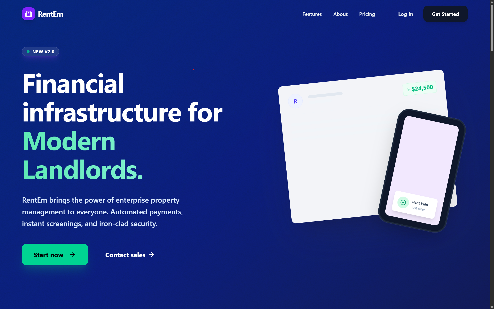

# Rental Service Backend



A production-grade, Spring Boot-based backend for the **RentFlow** property management platform. This service handles the core business logic for properties, tenants, leases, automated billing, payments, and maintenance workflows.

---

## 🚀 Key Features

### 🏢 Property & Unit Management
- **Hierarchical Structure**: Manage Properties and their individual Units.
- **Unit Details**: Track status (OCCUPIED/VACANT), usage types (Metered/Flat), and base rent.
- **Owner Dashboard**: Aggregated statistics for revenue, occupancy, and active concerns.

### 👥 Tenant & Lease Management
- **Digital Leases**: Create and track lease agreements with start/end dates.
- **Magic Link Authentication**: Secure, passwordless access for tenants via unique tokens sent to email.
- **Lease History**: Full audit trail of past and current leases.

### 💰 Billing & Payments
- **Automated Invoicing**: 
  - **Flat Rate**: Standard monthly rent.
  - **Metered**: Calculate utilities based on consumption (e.g., electricity readings).
- **Payment Integration**: Seamless payment processing via **Razorpay**.
- **Financial Tracking**: Real-time invoice status (PAID/PENDING/OVERDUE).

### 🛠️ Maintenance System
- **Ticket Management**: Tenants can raise issues with priority levels (Low to Emergency).
- **Workflow**: Owners can track status (Pending -> In Progress -> Completed).
- **Context Aware**: Requests are automatically linked to the active unit and tenant.

---

## 📂 Project Structure

```bash
com.rentalmanagement.rentalservice
├── config          # Security & App Config
├── controller      # REST API Endpoints
├── dto             # Data Transfer Objects
├── model           # JPA Entities (Database Tables)
├── repository      # Database Access Layer
├── security        # JWT & Auth Filters
├── service         # Business Logic
└── util            # Helper classes
```

---

## 🛠️ Technology Stack

- **Core**: Java 21, Spring Boot 3.3.4
- **Database**: PostgreSQL
- **Security**: Spring Security (JWT for Owners, Magic Links for Tenants)
- **Payments**: Razorpay SDK
- **Utilities**: Lombok, Spring Mail, Cloudinary (for file storage)
- **Build Tool**: Maven
- **Containerization**: Docker

---

## ⚡ Quick Start

### Prerequisites
- Java JDK 21
- PostgreSQL
- Maven
- Docker (Optional)

### Local Development

1. **Clone & Configure**
   ```bash
   git clone https://github.com/AnkitV15/Rental-Service.git
   cd rental-service
   ```
   Create a `.env` file (or set system env vars):
   ```properties
   DB_URL=jdbc:postgresql://localhost:5432/rentalservice
   DB_USERNAME=postgres
   DB_PASSWORD=your_password
   JWT_SECRET=your_secure_secret
   RAZORPAY_KEY_ID=your_key_id
   RAZORPAY_KEY_SECRET=your_key_secret
   FRONTEND_URL=http://localhost:5173 
   CLOUDINARY_CLOUD_NAME=your_cloud_name
   CLOUDINARY_API_KEY=your_api_key
   CLOUDINARY_API_SECRET=your_api_secret
   MAIL_USERNAME=your_email@gmail.com
   MAIL_PASSWORD=your_app_password
   MAIL_FROM=no-reply@rentem.com
   APP_URL=http://localhost:8080
   ```

2. **Run the Application**
   ```bash
   ./mvnw spring-boot:run
   ```
   The API will be live at `http://localhost:8080`.

---

## 🐳 Deployment (Docker & Railway)

The project includes a multi-stage `Dockerfile` optimized for production.

### Build & Run with Docker
```bash
# Build the image
docker build -t rental-backend .

# Run container (ensure env vars are passed)
docker run -p 8080:8080 --env-file .env rental-backend
```

### Deploy to Railway
1. Push this repository to GitHub.
2. Connect the repo to **Railway**.
3. Railway will automatically detect the `Dockerfile` and build it.
4. Set the required Environment Variables in the Railway dashboard.

---

## 🔌 API Endpoints Summary

| Module | Method | Endpoint | Description |
| :--- | :--- | :--- | :--- |
| **Auth** | POST | `/api/auth/login` | Owner Login |
| **Properties** | GET | `/api/owner/properties` | List Properties |
| **Leases** | POST | `/api/leases` | Create Lease |
| **Portal** | GET | `/api/leases/verify/{token}` | Tenant Access |
| **Payments** | POST | `/api/payments/create-order` | Init Payment |

---
*Built by [AnkitV15](https://github.com/AnkitV15) for the RentEm Platform.*
