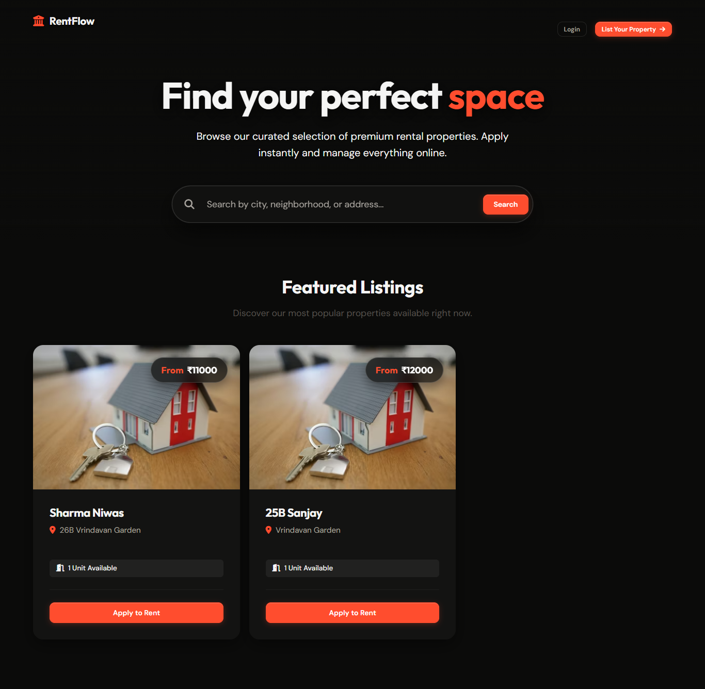
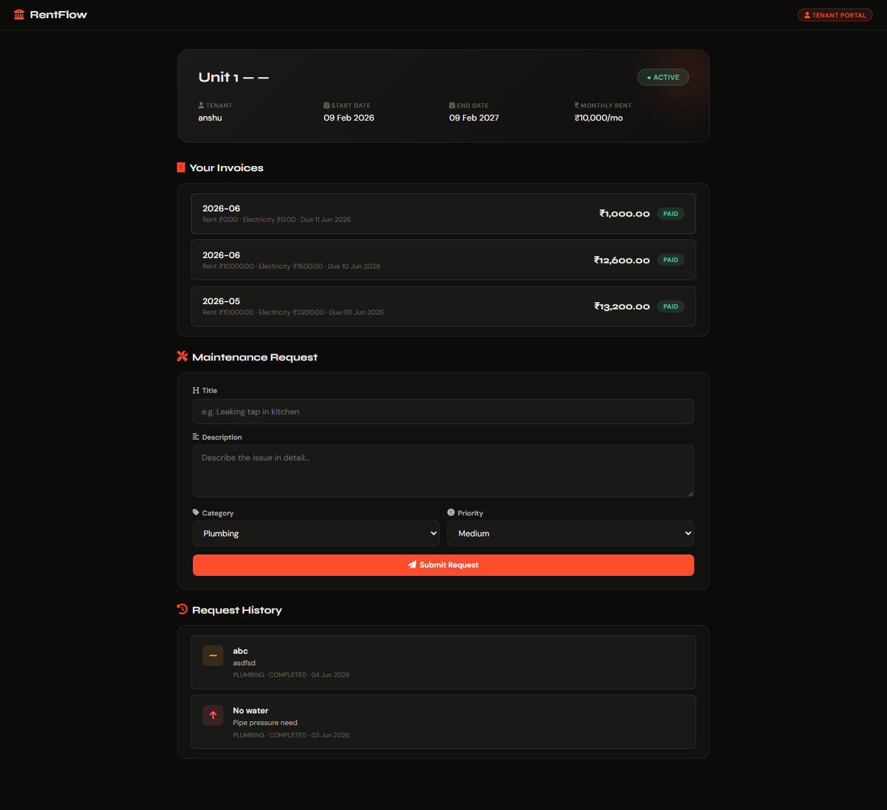

# RentFlow - Rental Management System



A production-grade, Spring Boot-based web application for the **RentFlow** property management platform. This system handles the core business logic for properties, tenants, leases, automated billing, payments, and maintenance workflows, all while providing a seamless glassmorphic user interface.

---

## 🚀 Key Features

### 🏢 Property & Unit Management
- **Hierarchical Structure**: Manage Properties and their individual Units.
- **Unit Details**: Track status (OCCUPIED/VACANT), usage types (Metered/Flat), and base rent.
- **Owner Dashboard**: Aggregated statistics for revenue, occupancy, and active concerns.

### 👥 Tenant & Lease Management
- **Digital Leases**: Create and track lease agreements with start/end dates.
- **Tenant Portal**: Tenants have their own dedicated dashboard to view invoices and raise maintenance issues.
- **Lease History**: Full audit trail of past and current leases.

### 💰 Dynamic Billing & Invoicing
- **Automated Invoicing**: 
  - **Flat Rate**: Standard monthly base rent automatically calculated.
  - **Metered Utilities**: Dynamically calculates utilities (e.g., electricity) by comparing the current meter reading against the last reading.
  - **Ad-hoc Charges**: Allows adding custom charges (e.g., maintenance fees, water bills) directly from the lease dashboard.
- **Financial Tracking**: Real-time invoice status (PAID/PENDING/OVERDUE).

### 🛠️ Maintenance System
- **Ticket Management**: Tenants can raise issues from their portal with priority levels.
- **Workflow**: Owners can track and resolve maintenance tickets (Pending -> In Progress -> Completed).
- **Context Aware**: Requests are automatically linked to the active unit and tenant.

---

## 📂 Project Structure

```bash
com.rentalmanagement.rentalservice
├── config          # Security, Web & Application Config (e.g., Local Uploads)
├── controller      # REST API Endpoints & Page Routing
├── dto             # Data Transfer Objects
├── model           # JPA Entities (PostgreSQL Database Tables)
├── repository      # Database Access Layer
├── security        # JWT & Role-Based Auth Filters
├── service         # Core Business Logic (Invoicing, Leases, etc.)
└── util            # Helper classes
```
*Frontend Code:* Located in `src/main/resources/static/` (HTML5, CSS3, Vanilla JS).

---

## 🛠️ Technology Stack

- **Backend Core**: Java 17+, Spring Boot 3.3.x
- **Database**: PostgreSQL (Spring Data JPA / Hibernate)
- **Security**: Spring Security (Role-Based Access Control)
- **Frontend**: HTML5, Vanilla CSS3 (Glassmorphism), JavaScript (Fetch API)
- **File Storage**: Local filesystem (`/uploads/` directory)
- **Build Tool**: Maven

---

## ⚡ Quick Start

### Prerequisites
- Java JDK 17 or higher
- PostgreSQL Database Server
- Maven

### Local Development

1. **Clone the Repository**
   ```bash
   git clone https://github.com/paras237/RentFlow.git
   cd RentFlow
   ```

2. **Configure the Database**
   Open `src/main/resources/application.yaml` and ensure the database credentials match your local PostgreSQL setup:
   ```yaml
   spring:
     datasource:
       url: jdbc:postgresql://localhost:5432/rental_db
       username: postgres
       password: root
   ```

3. **Run the Application**
   You can run the application directly using the Maven wrapper:
   ```bash
   ./mvnw spring-boot:run
   ```
   *(For Windows Command Prompt, use `mvnw.cmd spring-boot:run`)*

4. **Access the Website**
   Once the server starts, open your browser and navigate to:
   **http://localhost:8080**

---

## 🎨 Tenant Portal
Tenants get their own dedicated view to check their leases, track invoices, and submit maintenance tickets.


---

## 🔌 API Endpoints Summary

| Module | Method | Endpoint | Description |
| :--- | :--- | :--- | :--- |
| **Auth** | POST | `/api/auth/login` | Owner/Tenant Login |
| **Properties** | GET | `/api/owner/properties` | List all Properties |
| **Leases** | POST | `/api/leases` | Create a new Lease |
| **Invoices** | POST | `/api/invoices/generate` | Generate utility/rent invoices |
| **Maintenance**| GET | `/api/maintenance` | View maintenance tickets |

---
*Built by [paras237](https://github.com/paras237) for the RentFlow Platform.*
